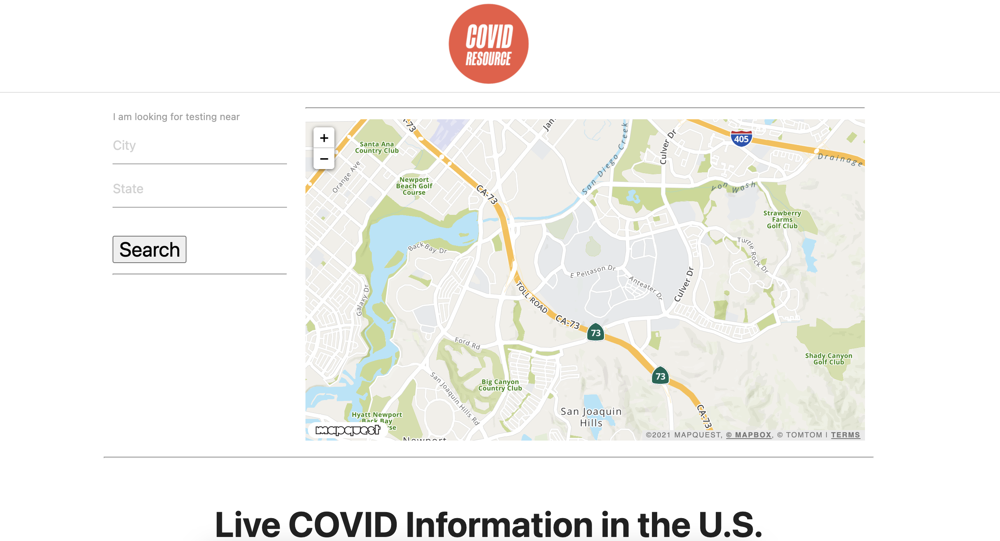

# Project 1: COVID Resource Application
## Team Members
- Yafiet Isaac
- Joseph Nielsen
- Carol Nguyen
- Nikki Davis

## Application Description
For those who are looking to get tested for COVID and are curious about recent U.S. cases. COVID Resource allows users to search for COVID testing centers by city and state and shows users the 10 closest locations. 

## Preview

## Tools and APIs Used
- HTML
- CSS
- JavaScript
- Materialize CDN
- MapQuest API
- HERE Geocoding and Search API (for COVID testing locations)
- COVID-19 Data API (via Rapid API)
- Tailor Brands (for logo)

## Challenges and Successes
- #1: Working collaboratively on GitHub --> learned how to do push and pull requests and resolve conflicts
- #2: The map and testing site APIs worked using longitiude and latitude coordinates, which is not very user friendly --> Implemented a third API that would translate a city into its longitude and latitude coordinates-- very user friendly!
- #3: Search would populate with Canada results instead of California --> Used HTML/CSS to recommend users to type the full name of the state --> Carlo helped us 

### Link to COVID Resource
https://caroltn.github.io/covid-resource/
